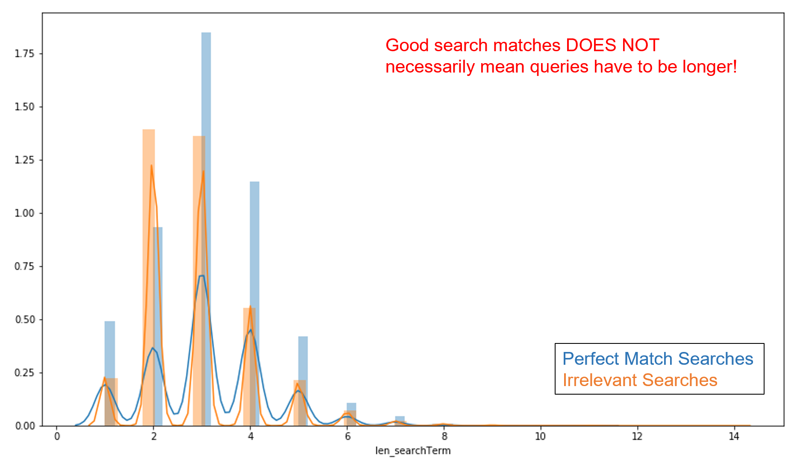
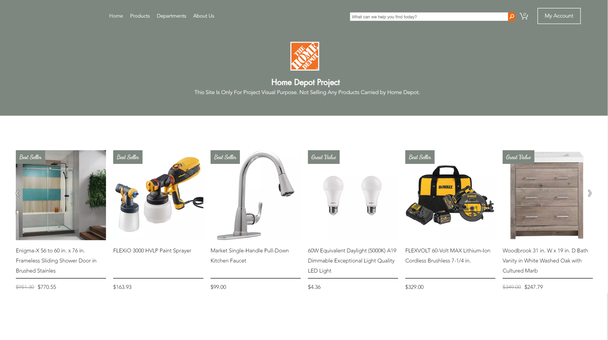
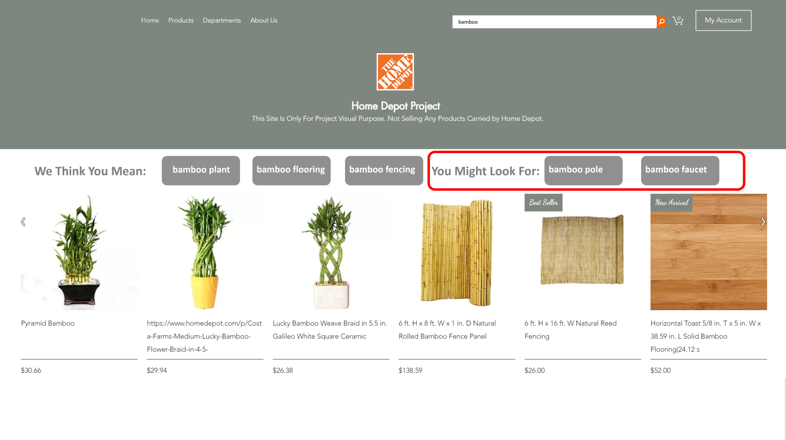

# Home Depot Search Term Recommendation

This project idea came to me from experience of a college friend  of mine who recently bought his first house and sought for items on home improvement websites like Home Depot. He went through a headache that *these websites sometimes return irrelevant products that he eventually lost patient on searching*. If this phenomenon goes viral, busiensses will lose significant amount of revenue.   

## Data Description

I used product information and past search result on Home Depot from a [Kaggle dataset](https://www.kaggle.com/c/home-depot-product-search-relevance/data). This project primarily involves *Product Title*, *Product Description*, *Search Queries*, and *Relevance* score, which is labeled by human raters in three categories: 
<ul>
<li>Perfect match (3)</li>
<li>Partially or Somewhat Relevant (2)</li>
<li>Irrelevant (1)</li>
</ul>

 ## Feature Extraction & EDA
Product information and search queries are collected in *product_descriptions.csv* and *train.csv* file, so I merged files by joining on *product_uid*. 
 
 
Then I did **Feature Extraction** on text variables and generated: 
<ul>
<li>Length of Search Query</li> 
<li>Length of Product Title</li>
<li>Length of Product Description</li>
<li>Ratio of Product Title Length to Query Length</li>
<li>Ratio of Product Description Length to Query Length</li>
</ul>

My assumption is that shorter search terms tend to get less relevant result back, since they are more general and have higher possibility to be ambiguous. So I compared the length of Perfect Match searches (relevent = 3) and Irrelevant searches (relevent <2).   
   
However, as seen in the graph above, both Perfect Match searches and Irrelevant Searches have search queries at 2 words and 3 words. Therefore, **it is all about how specific the customer has in mind about what he/she is looking for**. For example, if the user has the exact product in mind, such as 'Shark Vacuum' or 'Delta Faucet Handles', the search engine could pretty well detect the intent and gives back very relevant item. 

## Text Pre-Processing
I used **TextBlob** library to correct misspelling of queries, **WordNinja** to separate words with missing whitespace (i.e. WordNinja sepearates 'Ilovethismovie' to 'I', 'love','this','movie'), and **NLTK** to remove both pre-defined stopwords and customized stopwords as well as to lemmetize words. **Scikit-learn's TF-IDF** is applied to vectorize unique words taken from each text document into a weighted matrix of word frequency vector.   
The pipeline has been applied to Product Title, Product Description, and Search Queries. 

## Models
I chose to pick words that appeared between 5% to 30% frequency appeared in the entire corpus to be meaningful in TF-IDF vectorizor, and get a large sparse matrix. Therefore, I need to use a dimension reduction methodology to squeeze the matrix. After trying a few solutions, for product descriptions and product titles, **Non-negative Matrix Factorization (NMF)** combined with **Latent Dirichlet Allocation** gave me the most sensible clusterings. Regarding search queries, since there are limited product categories, I used **CorEx** to get lists of words that are closest to the anchors that I artificially manipulated. 

Text processing and Modeling codes can be found in [Product_description_processing.ipynb](./code/1-Product_description_processing.ipynb) and [Search_Relevance_Score.ipynb](./code/2-Search_Relevance_Score.ipynb).

Topic modeling result can be found in the [presentation slide](./presentation/presentation_slides.pdf).
## Demo
I built a website demo that simplifies Home Depot search function and results that it returns.   
_Home Page:_
    
Let's try a random search, 'bamboo', for example. And this is what it returns:   

  
The three gray tabs on the left are the search terms that search engine thinks what the customer intent to search. The two tabs on the right are the top two related terms that system found in the Product Title database, that customers can click and direct to other pages with bamboo pole or bamboo faucet products. 

## Next Steps
Natural Language Processing definitely plays a pivotal role in this project, but the search engine can utilize topic modeling: if the system detects a customer searching for a subcategory product, bathroom faucet, for example, it can trace back to the parent category and knows that *"Oh, this customer wants to decorate his/her bathroom. Maybe he/she needs a sink as well."* 